## 牛魔方后端使用文档

### 快速部署

#### 相关依赖

- [go 1.17+](https://go.dev/doc/install)
- [mongodb 4.0+](https://docs.mongodb.com/manual/administration/install-community/)

Go mod相关依赖包下载：

``` shell
cd niu-cube && go mod download
```

编译 & 运行

``` shell
cd niu-cube && go build && ./niu-cube
```

启动前请确保mongodb连接，并设置必要配置，配置填写查看**配置说明**。

报错可能：

- 排除端口占用之后，可能的报错包括配置文件不正确，依赖不正确等，如有此情况，请详细查看输出日志或与对接人员联系。
- MongoDB我们建议不接收远程连接，并设置为无密码方式。
- 配置文件所有必需项均无默认配置，因此所有**Mus**t开头的配置必须填写。
- [跨域排查](https://segmentfault.com/a/1190000011145364)

Go编译得到的为可执行二进制文件，直接通过shell运行即可。

### 配置说明

配置文件名称应为：niu-cube.conf，格式为json，位置为项目根目录；以下是示例配置，请根据需求进行修改：

``` json5
{
  "debug_level": 0,
  "listen_addr": 5080,
  "default_avatars": [
    "https://demo-qnrtc-files.qnsdk.com/img_avater_0.png",
    "https://demo-qnrtc-files.qnsdk.com/img_avater_1.png"
  ],
  "welcome_image": "https://demo-qnrtc-files.qnsdk.com/welcome0510.png",
  "welcome_url": "https://www.qiniu.com",
  "cheating_event_log_file": "<Nullable，Pandora日志写入文件路径，用于在线考试场景>",
  "dora_ai_ak": "<Nullable，Dora AI的AK>",
  "dora_ai_sk": "<Nullable，Dora AI的SK>",
  "dora_ai_app_id": "<Nullable，Dora AI的AppId>",
  "dora_sign_ak": "<Nullable，Dora登录用AK>",
  "dora_sign_sk": "<Nullable，Dora登录用SK>",
  "pandora_config": {
    "pandora_host": "Nullable，https://pandora-express-sdk.qiniu.com",
    "pandora_username": "<Nullable，Pandora账号用户名>",
    "pandora_pass": "<Nullable，Pandora账号密码>"
  },
  "mongo": {
    "uri": "mongodb://<Must，MongoDb的ip>:<Must，MongoDB的port>",
    "database": "<Must，你的数据库名称>"
  },
  "qiniu_key_pair": {
    "access_key": "<Must，你的七牛账号 AK>",
    "secret_key": "<Must，你的七牛账号 SK>"
  },
  "sms": {
    "provider": "qiniu",
    "fixed_codes": {
      "测试用手机": "测试用验证码，一一对应，启动之前记得删除这一行",
      "10086": "8888",
      "10010": "8888"
    },
    "qiniu_sms": {
      "signature_id": "<Must，你的短信签名ID>",
      "template_id": "<Must，你的短信模版ID>"
    }
  },
  "rtc": {
    "app_id": "<Must，你的RTC AppId>",
    "room_token_expire_s": 86400,
    "play_back_url": "https://pili-playback.qnsdk.com",
    "publish_url": "rtmp://pili-publish.qnsdk.com",
    "hub": "sdk-live",
    "stream_pattern": "niucube-%s"
  },
  "im": {
    "system_user_id": "niu-cube-system",
    "ping_ticker_s": 5,
    "pong_timeout_s": 30,
    "provider": "qiniu",
    "qiniu": {
      "app_env_prefix": "niucube_",
      "app_id": "Must，<你的AppId>",
      "app_token": "Must，<你的AppToken>",
      "app_endpoint": "https://s-1-3-s-api.maximtop.cn",
      "mongo": {
        "uri": "mongodb://<Must，用于IM的MongoDB的ip>:<Must，用于IM的MongoDB的port>",
        "database": "niu_cube_im"
      }
    }
  },
  "weixin": {
    "app_id": "<Nullable，你的AppId>",
    "app_secret": "<Nullable，你的AppSecret>",
    "bucket": "niu-cube-dev",
    "link": "https://demo-qnrtc-files.qnsdk.com"
  },
  "solutions": [
    {
      "id": "1",
      "title": "面试场景",
      "url": "niucube://interview/index",
      "type": "interview",
      "desc": "这是面试场景",
      "icon": "https://demo-qnrtc-files.qnsdk.com/icon-test.png"
    },
    {
      "id": "2",
      "title": "检修场景",
      "url": "niucube://repair/index",
      "type": "repair",
      "desc": "这是检修场景",
      "icon": "https://demo-qnrtc-files.qnsdk.com/icon-test.png"
    },
    {
      "id": "3",
      "title": "在线教育",
      "url": "niucube://classroom/index",
      "type": "classroom",
      "desc": "这是在线教育场景",
      "icon": "https://demo-qnrtc-files.qnsdk.com/icon-test.png"
    },
    {
      "id": "4",
      "title": "KTV",
      "url": "niucube://ktv/index",
      "type": "ktv",
      "desc": "这是KTV场景",
      "icon": "https://demo-qnrtc-files.qnsdk.com/icon-test.png"
    },
    {
      "id": "5",
      "title": "互动娱乐",
      "url": "niucube://show/index",
      "type": "show",
      "desc": "这是互动娱乐场景",
      "icon": "https://demo-qnrtc-files.qnsdk.com/icon-test.png"
    },
    {
      "id": "6",
      "title": "一起看电影",
      "url": "niucube://movie/index",
      "type": "movie",
      "desc": "这是一起看电影场景",
      "icon": "https://demo-qnrtc-files.qnsdk.com/icon-test.png"
    },
    {
      "id": "7",
      "title": "PK直播",
      "url": "",
      "type": "",
      "desc": "敬请期待",
      "icon": "https://demo-qnrtc-files.qnsdk.com/icon-test.png"
    }
  ],
  "solutions_ios": [
    {
      "id": "1",
      "title": "面试场景",
      "url": "http://fir.qnsdk.com/9l5z",
      "type": "",
      "desc": "请更新最新版本",
      "icon": "https://demo-qnrtc-files.qnsdk.com/icon-test.png"
    },
    {
      "id": "2",
      "title": "检修场景",
      "url": "http://fir.qnsdk.com/9l5z",
      "type": "",
      "desc": "请更新最新版本",
      "icon": "https://demo-qnrtc-files.qnsdk.com/icon-test.png"
    },
    {
      "id": "3",
      "title": "在线教育",
      "url": "http://fir.qnsdk.com/9l5z",
      "type": "",
      "desc": "请更新最新版本",
      "icon": "https://demo-qnrtc-files.qnsdk.com/icon-test.png"
    },
    {
      "id": "4",
      "title": "KTV",
      "url": "http://fir.qnsdk.com/9l5z",
      "type": "",
      "desc": "请更新最新版本",
      "icon": "https://demo-qnrtc-files.qnsdk.com/icon-test.png"
    },
    {
      "id": "5",
      "title": "互动娱乐",
      "url": "http://fir.qnsdk.com/9l5z",
      "type": "",
      "desc": "请更新最新版本",
      "icon": "https://demo-qnrtc-files.qnsdk.com/icon-test.png"
    },
    {
      "id": "6",
      "title": "PK直播",
      "url": "",
      "type": "",
      "desc": "敬请期待",
      "icon": "https://demo-qnrtc-files.qnsdk.com/icon-test.png"
    }
  ],
  "solutions_android": [
    {
      "id": "1",
      "title": "面试场景",
      "url": "http://fir.qnsdk.com/ecjs",
      "type": "",
      "desc": "请更新最新版本",
      "icon": "https://demo-qnrtc-files.qnsdk.com/icon-test.png"
    },
    {
      "id": "2",
      "title": "检修场景",
      "url": "http://fir.qnsdk.com/ecjs",
      "type": "",
      "desc": "请更新最新版本",
      "icon": "https://demo-qnrtc-files.qnsdk.com/icon-test.png"
    },
    {
      "id": "3",
      "title": "在线教育",
      "url": "http://fir.qnsdk.com/ecjs",
      "type": "",
      "desc": "请更新最新版本",
      "icon": "https://demo-qnrtc-files.qnsdk.com/icon-test.png"
    },
    {
      "id": "4",
      "title": "KTV",
      "url": "http://fir.qnsdk.com/ecjs",
      "type": "",
      "desc": "请更新最新版本",
      "icon": "https://demo-qnrtc-files.qnsdk.com/icon-test.png"
    },
    {
      "id": "5",
      "title": "互动娱乐",
      "url": "http://fir.qnsdk.com/ecjs",
      "type": "",
      "desc": "请更新最新版本",
      "icon": "https://demo-qnrtc-files.qnsdk.com/icon-test.png"
    },
    {
      "id": "6",
      "title": "PK直播",
      "url": "",
      "type": "",
      "desc": "敬请期待",
      "icon": "https://demo-qnrtc-files.qnsdk.com/icon-test.png"
    }
  ]
}
```

#### AK/SK获取

1. 登录/注册[官网](https://qiniu.com)
2. 点击头像或账号进入个人中心
3. 点击密钥管理
4. 生成或拷贝相关AK SK即可

#### SMS接入

参考链接：https://www.qiniu.com/products/sms#access

#### RTC接入

参考链接：https://developer.qiniu.com/rtc/10069/the-console-shows

#### IM接入

参考链接：https://developer.qiniu.com/IM/8332/startim

### Pandora接入

参考链接：https://www.qiniu.com/products/pandora#access

### Dora接入

参考链接：https://developer.qiniu.com/dora/7409/face-verification-self-service-opening-operation-manual

### 项目结构

#### 组织结构



#### 数据库


